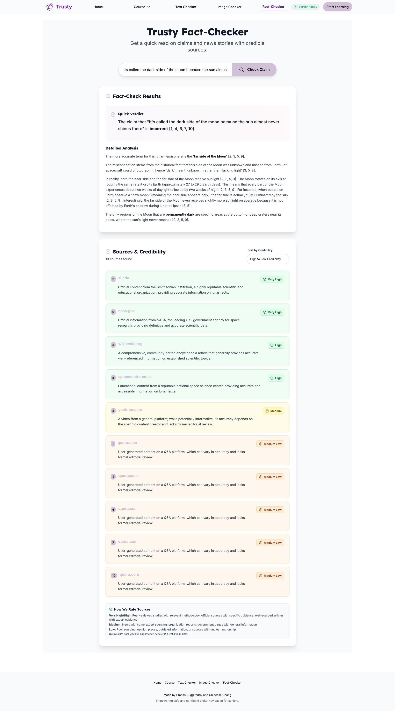
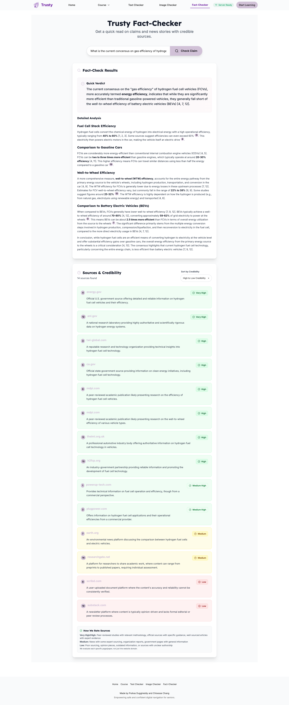
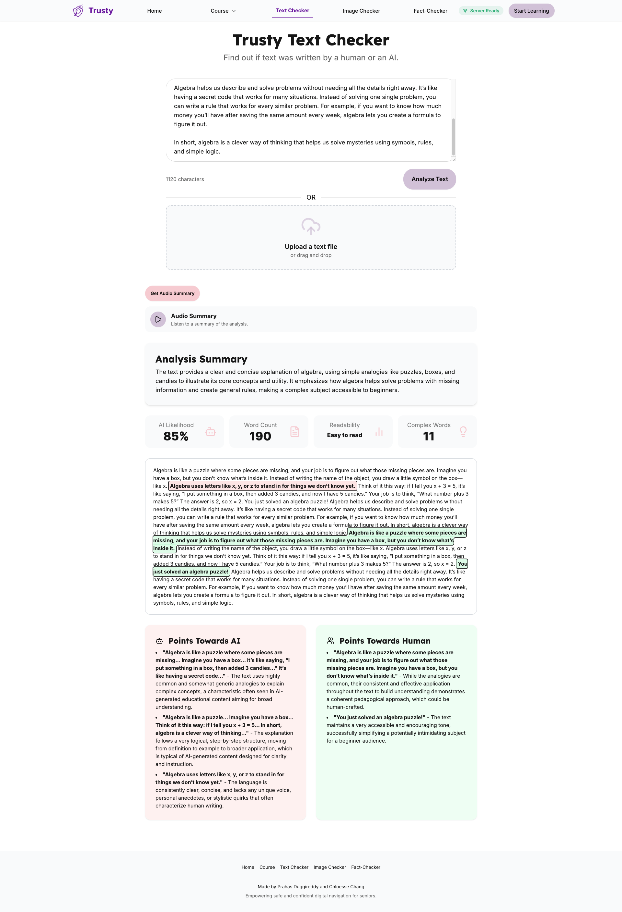
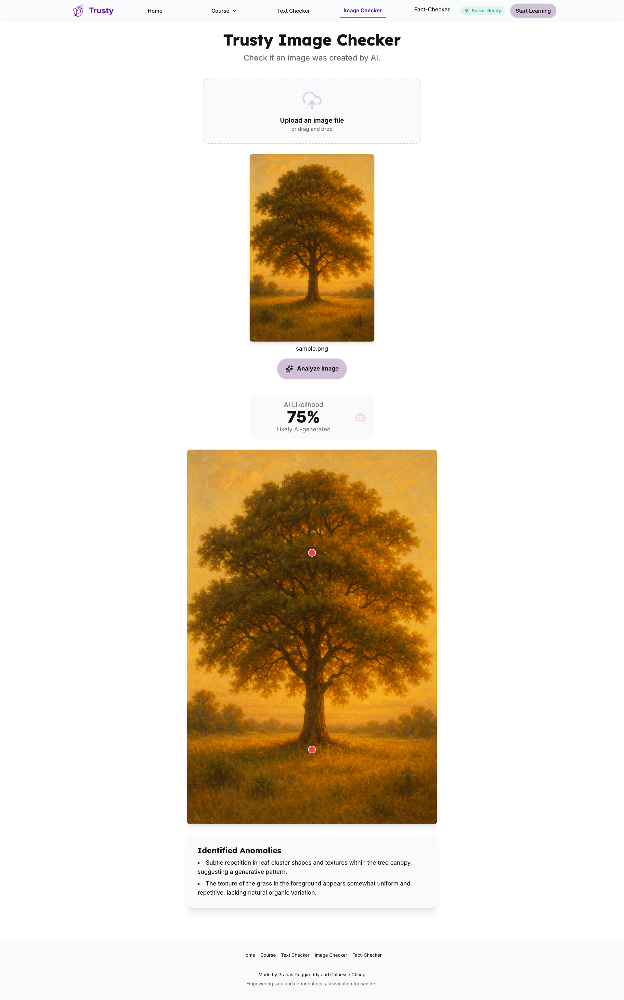
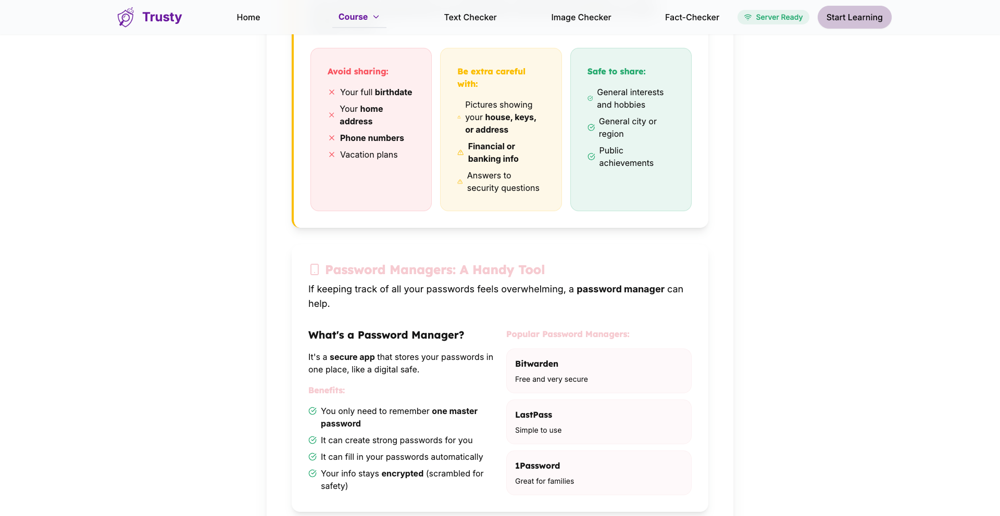
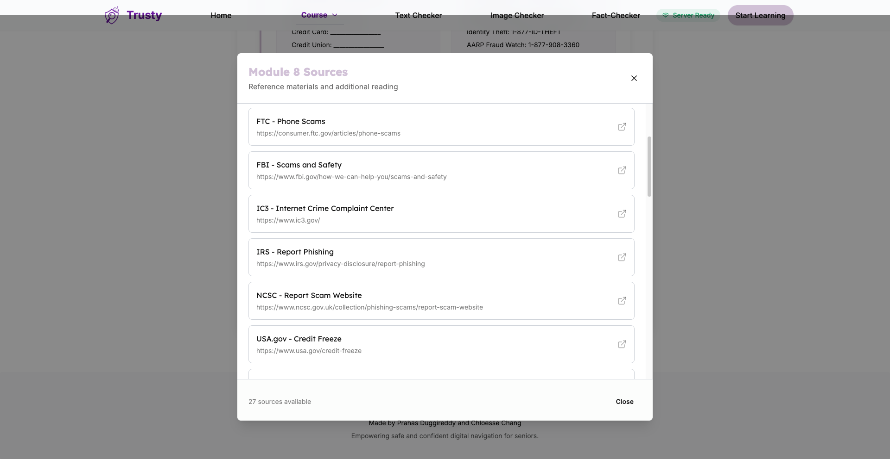

<div align="center">
  
  <h1>Trusty</h1>
  <p style="text-align: center;"><strong>Your Guide to Digital Safety</strong></p>
  
  <div>
    
    
    
    
    
    
    
    
    
    
  </div>

  <p style="text-align: center;"><a href="https://trusty-rho.vercel.app/"><strong>🌐 Visit Trusty</strong></a></p>
</div>

---
Trusty is an interactive web application designed to educate and empower users on digital safety. Featuring unique tools for fact-checking statements, analyzing text for misinformation, verifying images, and a comprehensive course on online safety. Trusty helps users combat digital threats and make informed decisions in the online world.

## Table of Contents

<ul>
  <li><a href="#key-features">Key Features</a></li>
  <li><a href="#deployment">Deployment</a></li>
  <li><a href="#local-development">Local Development</a></li>
  <li><a href="#repository-overview">Repository Overview</a></li>
  <li><a href="#gallery">Gallery</a></li>
  <li><a href="#license">License</a></li>
  <li><a href="#made-by">Made By</a></li>
</ul>

## Key Features

- **Fact Checker**: Quickly verify statements and get accurate answers, perfect for research and daily use.
- **Text Checker**: Analyze text for misinformation with scores and detailed explanations.
- **Image Checker**: Annotate and verify suspicious images to detect alterations or deepfakes.
- **Interactive Course**: Comprehensive modules on digital safety with sources for further reading.

## Deployment

<p>The Trusty application is deployed using modern cloud platforms for reliable and scalable hosting.</p>

<ul>
  <li><strong>Frontend:</strong> Hosted on <a href="https://vercel.com">Vercel</a> for fast, global web hosting.</li>
  <li><strong>Backend:</strong> Proxy server on <a href="https://render.com">Render</a> for API handling.</li>
</ul>

<div align="center">
  
  
</div>

<p>Deployments are automated on every push to the main branch.</p>

## Local Development

To run Trusty locally for development or testing:

1. **Fork** the repository on GitHub.
2. **Clone** your fork: `git clone https://github.com/your-username/trusty.git`
3. **Navigate** to the project: `cd trusty`
4. **Install** dependencies: `npm install`
5. **Start** the dev server: `npm run dev`
6. **Open** your browser to `http://localhost:5173`

Once you set up `Render`(see below), app will connect to the deployed backend for API calls. Server warming is handled automatically.

### Deploying Your Own Version

To deploy your forked version to your own accounts:

#### Frontend (Vercel)
1. Sign up for a [Vercel](https://vercel.com) account.
2. Connect your GitHub fork to Vercel.
3. Set environment variables on Vercel.
4. Deploy the frontend – Vercel will auto-detect the Vite setup.

#### Backend (Render)
1. Sign up for a [Render](https://render.com) account.
2. Create a new Web Service from your GitHub fork, selecting the `server/` directory.
3. Set environment variables:
4. Use the new proxy server URL in your `server/server.js` file
5. Deploy – Render will build and run the Express server.

Update the frontend's API URLs to point to your Render backend.

<h3>Repository Overview</h3>

<ul>
  <li>
    <details>
      <summary><kbd>components/</kbd> – reusable UI components</summary>
      <ul>
        <li>
          <details>
            <summary><kbd>common/</kbd> – shared components</summary>
            <ul>
              <li><kbd>AudioPlayer.tsx</kbd></li>
              <li><kbd>FileUpload.tsx</kbd></li>
              <li><kbd>FinalQuiz.tsx</kbd></li>
              <li><kbd>LoadingSpinner.tsx</kbd></li>
              <li><kbd>ServerStatusIndicator.tsx</kbd></li>
              <li><kbd>ServerStatusPopup.tsx</kbd></li>
              <li><kbd>SourcesButton.tsx</kbd></li>
              <li><kbd>TestimonialCarousel.tsx</kbd></li>
            </ul>
          </details>
        </li>
        <li>
          <details>
            <summary><kbd>course/</kbd> – course-specific components</summary>
            <ul>
              <li><kbd>Module1.tsx</kbd></li>
              <li><kbd>Module2.tsx</kbd></li>
              <li><kbd>Module3.tsx</kbd></li>
              <li><kbd>Module4.tsx</kbd></li>
              <li><kbd>Module5.tsx</kbd></li>
              <li><kbd>Module6.tsx</kbd></li>
              <li><kbd>Module7.tsx</kbd></li>
              <li><kbd>Module8.tsx</kbd></li>
            </ul>
          </details>
        </li>
      </ul>
    </details>
  </li>
  <li>
    <details>
      <summary><kbd>pages/</kbd> – main application pages</summary>
      <ul>
        <li><kbd>AIImageCheckerPage.tsx</kbd></li>
        <li><kbd>AITextCheckerPage.tsx</kbd></li>
        <li><kbd>CoursePage.tsx</kbd></li>
        <li><kbd>FactCheckerPage.tsx</kbd></li>
        <li><kbd>FinalQuizPage.tsx</kbd></li>
        <li><kbd>HomePage.tsx</kbd></li>
      </ul>
    </details>
  </li>
  <li>
    <details>
      <summary><kbd>hooks/</kbd> – custom React hooks</summary>
      <ul>
        <li><kbd>useAudioPlayer.ts</kbd></li>
        <li><kbd>useServerStatus.ts</kbd></li>
      </ul>
    </details>
  </li>
  <li>
    <details>
      <summary><kbd>services/</kbd> – API and service integrations</summary>
      <ul>
        <li><kbd>geminiService.ts</kbd></li>
      </ul>
    </details>
  </li>
  <li>
    <details>
      <summary><kbd>constants/</kbd> – application constants</summary>
      <ul>
        <li><kbd>courseData.tsx</kbd></li>
        <li><kbd>testimonialsData.tsx</kbd></li>
      </ul>
    </details>
  </li>
  <li>
    <details>
      <summary><kbd>modules/</kbd> – course content | .md kept as a reference, we currently use .tsx</summary>
      <ul>
        <li><kbd>module1.md</kbd></li>
        <li><kbd>module2.md</kbd></li>
        <li><kbd>module3.md</kbd></li>
        <li><kbd>module4.md</kbd></li>
        <li><kbd>module5.md</kbd></li>
        <li><kbd>module6.md</kbd></li>
        <li><kbd>module7.md</kbd></li>
        <li><kbd>module8.md</kbd></li>
      </ul>
    </details>
  </li>
  <li>
    <details>
      <summary><kbd>server/</kbd> – backend proxy server</summary>
      <ul>
        <li><kbd>package.json</kbd></li>
        <li><kbd>server.js</kbd></li>
      </ul>
    </details>
  </li>
  <li>
    <details>
      <summary><kbd>public/</kbd> – static assets</summary>
      <ul>
        <li>
          <details>
            <summary><kbd>assets/</kbd> – images</summary>
            <ul>
              <li><kbd>images/</kbd></li>
            </ul>
          </details>
        </li>
      </ul>
    </details>
  </li>
  <li>
    <details>
      <summary><kbd>utils/</kbd> – utility functions</summary>
      <ul>
        <li>Helper functions</li>
      </ul>
    </details>
  </li>
  <li>
    <details>
      <summary><kbd>assets/</kbd> – additional assets</summary>
      <ul>
        <li><kbd>documents/</kbd></li>
        <li><kbd>images/</kbd></li>
        <li><kbd>readme/</kbd></li>
      </ul>
    </details>
  </li>
  <li><kbd>App.tsx</kbd> – main app component</li>
  <li><kbd>config.ts</kbd> – configuration file</li>
  <li><kbd>index.html</kbd> – HTML entry point</li>
  <li><kbd>index.tsx</kbd> – React entry point</li>
  <li><kbd>LICENSE</kbd> – license file</li>
  <li><kbd>package.json</kbd> – project dependencies</li>
  <li><kbd>README.md</kbd> – this file</li>
  <li><kbd>tailwind.config.js</kbd> – Tailwind CSS config</li>
  <li><kbd>tsconfig.json</kbd> – TypeScript config</li>
  <li><kbd>types.ts</kbd> – type definitions</li>
  <li><kbd>vercel.json</kbd> – Vercel deployment config</li>
  <li><kbd>vite-env.d.ts</kbd> – Vite environment types</li>
  <li><kbd>vite.config.ts</kbd> – Vite config</li>
  <li><kbd>.gitignore</kbd> – Git ignore file</li>
  <li><kbd>package-lock.json</kbd> – NPM lock file</li>
</ul>


---

<div align="center"><h2 style="font-size: 2.5em;"> Gallery</h2></div>

### Fact Checker

> Get quick answers to various statements you hear!


>[!TIP]
> Great for research too!



### Text Checker

> Get a score AND an explanation!



### Image Checker

> Get **annotations** on suspicious images



### Detailed Course



>[!NOTE]
> View sources for extra reading!



## License

This project is licensed under the **MIT License** – see the [LICENSE](LICENSE) file for details.

```yaml
Copyright (c) 2025 Prahas Duggireddy and Chloesse Chang
```

---

## Made By

<div align="center">
  <strong>Prahas Duggireddy</strong> • <strong>Chloesse Chang</strong>
  <br/>
  <em>Made by Prahas and Chloesse started in 2025</em>
</div>
